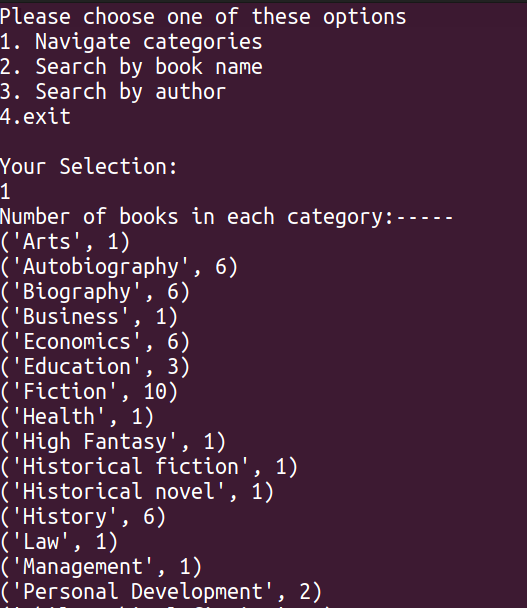

# sql_bookdatabase
Building a Library database and using sql to manage and check status of avaliable books.
The database is created from a csv file containing several book information (source:https://www.kaggle.com/datasets/bimalgajera/library-books). 

To run:
./apps.py

This provides several user specific options on how to navigate the database. One can check overall number of  books based on the category, one can also look for books and their avilability status based on eihter by their title or by the author.
Here is a screenshot of the output -

